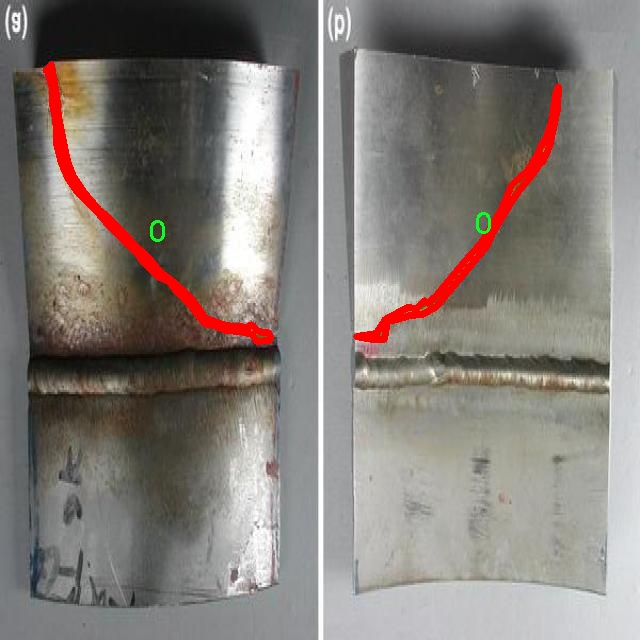
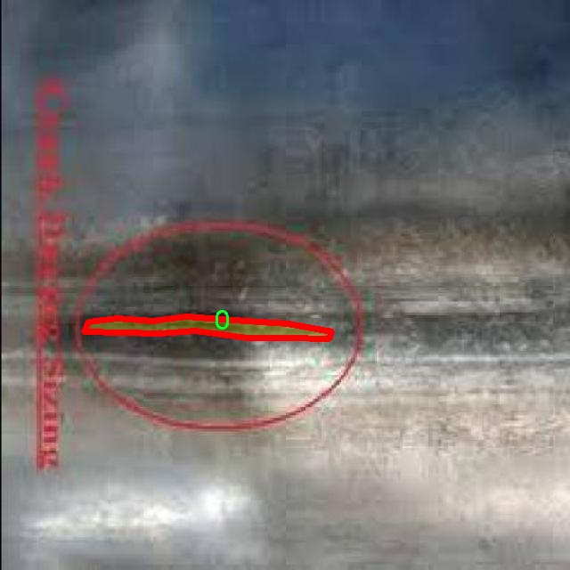

### 1.背景意义

研究背景与意义

金属裂缝的检测与分割在工业制造和结构安全领域中具有重要的实际意义。随着现代工业的快速发展，金属材料的广泛应用使得金属结构的完整性与安全性成为亟待解决的问题。金属裂缝不仅会影响产品的质量，还可能导致严重的安全隐患，甚至引发灾难性事故。因此，开发高效、准确的裂缝检测技术显得尤为重要。

传统的裂缝检测方法主要依赖于人工检查和简单的图像处理技术，这些方法不仅耗时耗力，而且容易受到人为因素的影响，导致检测结果的不准确。近年来，随着深度学习技术的快速发展，基于计算机视觉的自动化检测方法逐渐成为研究的热点。YOLO（You Only Look Once）系列模型因其高效的实时检测能力而被广泛应用于目标检测任务中。YOLOv11作为该系列的最新版本，结合了更先进的网络结构和算法，具备更强的特征提取能力和更高的检测精度。

本研究旨在基于改进的YOLOv11模型，构建一个针对金属裂缝的检测与分割系统。通过对收集到的569张金属裂缝图像进行训练，该系统能够实现对金属裂缝的自动检测与精确分割。数据集中仅包含一个类别的裂缝图像，尽管类别数量较少，但其在实际应用中却具有重要的代表性和应用价值。通过对该数据集的深入分析与模型训练，我们期望能够提高金属裂缝检测的准确性和效率，为工业生产中的质量控制和安全监测提供有效的技术支持。

综上所述，基于改进YOLOv11的金属裂缝检测分割系统的研究，不仅具有重要的理论意义，也将为实际应用提供有力的技术保障，推动智能制造和安全监测技术的发展。

### 2.视频效果

[2.1 视频效果](https://www.bilibili.com/video/BV1qUUBYeEvy/)

### 3.图片效果


##### [项目涉及的源码数据来源链接](https://kdocs.cn/l/cszuIiCKVNis)**

注意：本项目提供训练的数据集和训练教程,由于版本持续更新,暂不提供权重文件（best.pt）,请按照6.训练教程进行训练后实现上图演示的效果。

### 4.数据集信息

##### 4.1 本项目数据集类别数＆类别名

nc: 1
names: ['0']


该项目为【图像分割】数据集，请在【训练教程和Web端加载模型教程（第三步）】这一步的时候按照【图像分割】部分的教程来训练

##### 4.2 本项目数据集信息介绍

本项目数据集信息介绍

本项目所使用的数据集名为“1208_crack_seg_add”，专门用于训练和改进YOLOv11模型，以实现高效的金属裂缝检测与分割。该数据集的设计旨在为深度学习算法提供丰富的训练样本，以提升其在实际应用中的准确性和鲁棒性。数据集中包含的类别数量为1，具体类别列表仅为“0”，这表明该数据集专注于检测金属表面上的裂缝，旨在为裂缝的自动识别和分割提供精确的标注。

在数据集的构建过程中，特别注重样本的多样性和代表性，以确保模型在不同场景下的适应能力。数据集中的图像涵盖了多种金属材料和不同环境条件下的裂缝实例，包括但不限于不同光照、角度和背景的变化。这种多样性使得模型能够学习到更为广泛的特征，从而提高其在实际应用中的泛化能力。

此外，数据集的标注过程采用了严格的标准，确保每个裂缝的边界都被精确地划定，以便于后续的分割任务。通过使用高质量的图像和精确的标注，项目团队期望能够训练出一个能够准确检测和分割金属裂缝的YOLOv11模型，从而为工业检测、维护和安全监测等领域提供有效的技术支持。

总之，“1208_crack_seg_add”数据集为本项目的成功实施奠定了坚实的基础，期望通过对该数据集的深入分析和应用，推动金属裂缝检测技术的进步，最终实现更高效的工业检测解决方案。







### 5.全套项目环境部署视频教程（零基础手把手教学）

[5.1 所需软件PyCharm和Anaconda安装教程（第一步）](https://www.bilibili.com/video/BV1BoC1YCEKi/?spm_id_from=333.999.0.0&vd_source=bc9aec86d164b67a7004b996143742dc)


[5.2 安装Python虚拟环境创建和依赖库安装视频教程（第二步）](https://www.bilibili.com/video/BV1ZoC1YCEBw?spm_id_from=333.788.videopod.sections&vd_source=bc9aec86d164b67a7004b996143742dc)

### 6.改进YOLOv11训练教程和Web_UI前端加载模型教程（零基础手把手教学）

[6.1 改进YOLOv11训练教程和Web_UI前端加载模型教程（第三步）](https://www.bilibili.com/video/BV1BoC1YCEhR?spm_id_from=333.788.videopod.sections&vd_source=bc9aec86d164b67a7004b996143742dc)


按照上面的训练视频教程链接加载项目提供的数据集，运行train.py即可开始训练



     Epoch   gpu_mem       box       obj       cls    labels  img_size
     1/200     20.8G   0.01576   0.01955  0.007536        22      1280: 100%|██████████| 849/849 [14:42<00:00,  1.04s/it]
               Class     Images     Labels          P          R     mAP@.5 mAP@.5:.95: 100%|██████████| 213/213 [01:14<00:00,  2.87it/s]
                 all       3395      17314      0.994      0.957      0.0957      0.0843

     Epoch   gpu_mem       box       obj       cls    labels  img_size
     2/200     20.8G   0.01578   0.01923  0.007006        22      1280: 100%|██████████| 849/849 [14:44<00:00,  1.04s/it]
               Class     Images     Labels          P          R     mAP@.5 mAP@.5:.95: 100%|██████████| 213/213 [01:12<00:00,  2.95it/s]
                 all       3395      17314      0.996      0.956      0.0957      0.0845

     Epoch   gpu_mem       box       obj       cls    labels  img_size
     3/200     20.8G   0.01561    0.0191  0.006895        27      1280: 100%|██████████| 849/849 [10:56<00:00,  1.29it/s]
               Class     Images     Labels          P          R     mAP@.5 mAP@.5:.95: 100%|███████   | 187/213 [00:52<00:00,  4.04it/s]
                 all       3395      17314      0.996      0.957      0.0957      0.0845


###### [项目数据集下载链接](https://kdocs.cn/l/cszuIiCKVNis)

### 7.原始YOLOv11算法讲解

YOLOv11是一种由Ultralytics公司开发的最新一代目标检测模型，以其增强的特征提取能力和更高的效率在计算机视觉领域引人注目。该模型在架构上进行了关键升级，通过更新主干和颈部结构，显著提高了对复杂视觉场景的理解和处理精度。YOLOv11不仅在目标检测上表现出色，还支持实例分割、图像分类、姿态估计和定向目标检测（OBB）等任务，展示出其多功能性。

与其前身YOLOv8相比，YOLOv11在设计上实现了深度和宽度的改变，同时引入了几个创新机制。其中，C3k2机制是对YOLOv8中的C2f的改进，提升了浅层特征的处理能力；C2PSA机制则进一步优化了特征图的处理流程。解耦头的创新设计，通过增加两个深度卷积（DWConv），提高了模型对细节的感知能力和分类准确性。

在性能上，YOLOv11m模型在COCO数据集上的平均精度（mAP）提高，并减少了22%的参数量，确保了在运算效率上的突破。该模型可以部署在多种平台上，包括边缘设备、云平台以及支持NVIDIA GPU的系统，彰显出卓越的灵活性和适应性。总体而言，YOLOv11通过一系列的创新突破，对目标检测领域产生了深远的影响，并为未来的开发提供了新的研究方向。


****文档**** ： _ _https://docs.ultralytics.com/models/yolo11/__

****代码链接**** ： _ _https://github.com/ultralytics/ultralytics__

******Performance Metrics******


​ ** **关键特性****

****◆**** ** **增强的特征提取能力**** ：YOLO11采用了改进的主干和颈部架构，增强了 ** **特征提取****
能力，能够实现更精确的目标检测和复杂任务的执行。

****◆**** ** **优化的效率和速度****
：YOLO11引入了精细化的架构设计和优化的训练流程，提供更快的处理速度，并在准确性和性能之间保持最佳平衡。

****◆**** ** **参数更少、精度更高****
：通过模型设计的改进，YOLO11m在COCO数据集上实现了更高的平均精度（mAP），同时使用的参数比YOLOv8m少22%，使其在计算上更加高效，而不牺牲准确性。

****◆**** ** **跨环境的适应性**** ：YOLO11可以无缝部署在各种环境中，包括边缘设备、云平台和支持NVIDIA
GPU的系统，确保最大的灵活性。

****◆**** ** **支持广泛任务****
：无论是目标检测、实例分割、图像分类、姿态估计还是定向目标检测（OBB），YOLO11都旨在应对一系列计算机视觉挑战。

****支持的任务和模式****


​YOLO11建立在YOLOv8中引入的多功能模型范围之上，为各种计算机视觉任务提供增强的支持:


​该表提供了YOLO11模型变体的概述，展示了它们在特定任务中的适用性以及与Inference、Validation、Training和Export等操作模式的兼容性。从实时检测到复杂的分割任务
，这种灵活性使YOLO11适用于计算机视觉的广泛应用。

##### yolov11的创新

■ yolov8 VS yolov11

YOLOv5，YOLOv8和YOLOv11均是ultralytics公司的作品，ultralytics出品必属精品。


​ **具体创新点** ：

**① 深度（depth）和宽度 （width）**

YOLOv8和YOLOv11是基本上完全不同。

**② C3k2机制**

C3k2有参数为c3k，其中在网络的浅层c3k设置为False。C3k2就相当于YOLOv8中的C2f。


​ **③ C2PSA机制**

下图为C2PSA机制的原理图。


​ **④ 解耦头**

解耦头中的分类检测头增加了两个 **DWConv** 。


▲Conv

    
    
    def autopad(k, p=None, d=1):  # kernel, padding, dilation
    
        """Pad to 'same' shape outputs."""
    
        if d > 1:
    
            k = d * (k - 1) + 1 if isinstance(k, int) else [d * (x - 1) + 1 for x in k]  # actual kernel-size
    
        if p is None:
    
            p = k // 2 if isinstance(k, int) else [x // 2 for x in k]  # auto-pad
    
    return p
    
    
    class Conv(nn.Module):
    
        """Standard convolution with args(ch_in, ch_out, kernel, stride, padding, groups, dilation, activation)."""
    
    
        default_act = nn.SiLU()  # default activation
    
    
        def __init__(self, c1, c2, k=1, s=1, p=None, g=1, d=1, act=True):
    
            """Initialize Conv layer with given arguments including activation."""
    
            super().__init__()
    
            self.conv = nn.Conv2d(c1, c2, k, s, autopad(k, p, d), groups=g, dilation=d, bias=False)
    
            self.bn = nn.BatchNorm2d(c2)
    
            self.act = self.default_act if act is True else act if isinstance(act, nn.Module) else nn.Identity()
    
    
        def forward(self, x):
    
            """Apply convolution, batch normalization and activation to input tensor."""
    
            return self.act(self.bn(self.conv(x)))
    
    
        def forward_fuse(self, x):
    
            """Perform transposed convolution of 2D data."""
    
            return self.act(self.conv(x))

▲Conv2d

    
    
    torch.nn.Conv2d(in_channels, out_channels, kernel_size, stride=1, padding=0, dilation=1, groups=1, bias=True, padding_mode='zeros')

▲DWConv

DWConv ** **代表 Depthwise Convolution（深度卷积）****
，是一种在卷积神经网络中常用的高效卷积操作。它主要用于减少计算复杂度和参数量。

    
    
    class DWConv(Conv):
    
        """Depth-wise convolution."""
    
    
        def __init__(self, c1, c2, k=1, s=1, d=1, act=True):  # ch_in, ch_out, kernel, stride, dilation, activation
    
            """Initialize Depth-wise convolution with given parameters."""
    
            super().__init__(c1, c2, k, s, g=math.gcd(c1, c2), d=d, act=act)


### 8.200+种全套改进YOLOV11创新点原理讲解

#### 8.1 200+种全套改进YOLOV11创新点原理讲解大全

由于篇幅限制，每个创新点的具体原理讲解就不全部展开，具体见下列网址中的改进模块对应项目的技术原理博客网址【Blog】（创新点均为模块化搭建，原理适配YOLOv5~YOLOv11等各种版本）

[改进模块技术原理博客【Blog】网址链接](https://gitee.com/qunmasj/good)


#### 8.2 精选部分改进YOLOV11创新点原理讲解

###### 这里节选部分改进创新点展开原理讲解(完整的改进原理见上图和[改进模块技术原理博客链接](https://gitee.com/qunmasj/good)【如果此小节的图加载失败可以通过CSDN或者Github搜索该博客的标题访问原始博客，原始博客图片显示正常】

### Gold-YOLO简介
YOLO再升级：华为诺亚提出Gold-YOLO，聚集-分发机制打造新SOTA
在过去的几年中，YOLO系列模型已经成为实时目标检测领域的领先方法。许多研究通过修改架构、增加数据和设计新的损失函数，将基线推向了更高的水平。然而以前的模型仍然存在信息融合问题，尽管特征金字塔网络（FPN）和路径聚合网络（PANet）已经在一定程度上缓解了这个问题。因此，本研究提出了一种先进的聚集和分发机制（GD机制），该机制通过卷积和自注意力操作实现。这种新设计的模型被称为Gold-YOLO，它提升了多尺度特征融合能力，在所有模型尺度上实现了延迟和准确性的理想平衡。此外，本文首次在YOLO系列中实现了MAE风格的预训练，使得YOLO系列模型能够从无监督预训练中受益。Gold-YOLO-N在COCO val2017数据集上实现了出色的39.9% AP，并在T4 GPU上实现了1030 FPS，超过了之前的SOTA模型YOLOv6-3.0-N，其FPS相似，但性能提升了2.4%。


#### Gold-YOLO


YOLO系列的中间层结构采用了传统的FPN结构，其中包含多个分支用于多尺度特征融合。然而，它只充分融合来自相邻级别的特征，对于其他层次的信息只能间接地进行“递归”获取。

传统的FPN结构在信息传输过程中存在丢失大量信息的问题。这是因为层之间的信息交互仅限于中间层选择的信息，未被选择的信息在传输过程中被丢弃。这种情况导致某个Level的信息只能充分辅助相邻层，而对其他全局层的帮助较弱。因此，整体上信息融合的有效性可能受到限制。
为了避免在传输过程中丢失信息，本文采用了一种新颖的“聚集和分发”机制（GD），放弃了原始的递归方法。该机制使用一个统一的模块来收集和融合所有Level的信息，并将其分发到不同的Level。通过这种方式，作者不仅避免了传统FPN结构固有的信息丢失问题，还增强了中间层的部分信息融合能力，而且并没有显著增加延迟。


# 8.低阶聚合和分发分支 Low-stage gather-and-distribute branch
从主干网络中选择输出的B2、B3、B4、B5特征进行融合，以获取保留小目标信息的高分辨率特征。


低阶特征对齐模块 (Low-stage feature alignment module)： 在低阶特征对齐模块（Low-FAM）中，采用平均池化（AvgPool）操作对输入特征进行下采样，以实现统一的大小。通过将特征调整为组中最小的特征大小（ R B 4 = 1 / 4 R ） （R_{B4} = 1/4R）（R 
B4 =1/4R），我们得到对齐后的特征F a l i g n F_{align}F align 。低阶特征对齐技术确保了信息的高效聚合，同时通过变换器模块来最小化后续处理的计算复杂性。其中选择 R B 4 R_{B4}R B4 作为特征对齐的目标大小主要基于保留更多的低层信息的同时不会带来较大的计算延迟。
低阶信息融合模块(Low-stage information fusion module)： 低阶信息融合模块（Low-IFM）设计包括多层重新参数化卷积块（RepBlock）和分裂操作。具体而言，RepBlock以F a l i g n ( c h a n n e l = s u m ( C B 2 ， C B 3 ， C B 4 ， C B 5 ) ) F_{align} (channel= sum(C_{B2}，C_{B3}，C_{B4}，C_{B5}))F align (channel=sum(C B2 ，C B3 ，C B4 ，C B5 )作为输入，并生成F f u s e ( c h a n n e l = C B 4 + C B 5 ) F_{fuse} (channel= C_{B4} + C_{B5})F fuse (channel=C B4 +C B5 )。其中中间通道是一个可调整的值（例如256），以适应不同的模型大小。由RepBlock生成的特征随后在通道维度上分裂为F i n j P 3 Finj_P3Finj P 3和F i n j P 4 Finj_P4Finj P 4，然后与不同级别的特征进行融合。


# 8.高阶聚合和分发分支 High-stage gather-and-distribute branch
高级全局特征对齐模块（High-GD）将由低级全局特征对齐模块（Low-GD）生成的特征{P3, P4, P5}进行融合。


高级特征对齐模块(High-stage feature alignment module)： High-FAM由avgpool组成，用于将输入特征的维度减小到统一的尺寸。具体而言，当输入特征的尺寸为{R P 3 R_{P3}R P3 , R P 4 R_{P4}R P4 , R P 5 R_{P 5}R P5 }时，avgpool将特征尺寸减小到该特征组中最小的尺寸（R P 5 R_{P5}R P5  = 1/8R）。由于transformer模块提取了高层次的信息，池化操作有助于信息聚合，同时降低了transformer模块后续步骤的计算需求。

Transformer融合模块由多个堆叠的transformer组成，transformer块的数量为L。每个transformer块包括一个多头注意力块、一个前馈网络（FFN）和残差连接。采用与LeViT相同的设置来配置多头注意力块，使用16个通道作为键K和查询Q的头维度，32个通道作为值V的头维度。为了加速推理过程，将层归一化操作替换为批归一化，并将所有的GELU激活函数替换为ReLU。为了增强变换器块的局部连接，在两个1x1卷积层之间添加了一个深度卷积层。同时，将FFN的扩展因子设置为2，以在速度和计算成本之间取得平衡。

信息注入模块(Information injection module)： 高级全局特征对齐模块（High-GD）中的信息注入模块与低级全局特征对齐模块（Low-GD）中的相同。在高级阶段，局部特征（Flocal）等于Pi，因此公式如下所示：


### 增强的跨层信息流动 Enhanced cross-layer information flow
为了进一步提升性能，从YOLOv11 中的PAFPN模块中得到启发，引入了Inject-LAF模块。该模块是注入模块的增强版，包括了一个轻量级相邻层融合（LAF）模块，该模块被添加到注入模块的输入位置。为了在速度和准确性之间取得平衡，设计了两个LAF模型：LAF低级模型和LAF高级模型，分别用于低级注入（合并相邻两层的特征）和高级注入（合并相邻一层的特征）。它们的结构如图5(b)所示。为了确保来自不同层级的特征图与目标大小对齐，在实现中的两个LAF模型仅使用了三个操作符：双线性插值（上采样过小的特征）、平均池化（下采样过大的特征）和1x1卷积（调整与目标通道不同的特征）。模型中的LAF模块与信息注入模块的结合有效地平衡了准确性和速度之间的关系。通过使用简化的操作，能够增加不同层级之间的信息流路径数量，从而提高性能而不显著增加延迟。


### 9.系统功能展示

图9.1.系统支持检测结果表格显示

  图9.2.系统支持置信度和IOU阈值手动调节

  图9.3.系统支持自定义加载权重文件best.pt(需要你通过步骤5中训练获得)

  图9.4.系统支持摄像头实时识别

  图9.5.系统支持图片识别

  图9.6.系统支持视频识别

  图9.7.系统支持识别结果文件自动保存

  图9.8.系统支持Excel导出检测结果数据


### 10. YOLOv11核心改进源码讲解

#### 10.1 rep_block.py

以下是对代码中最核心部分的分析和详细注释。主要保留了与`DiverseBranchBlock`、`WideDiverseBranchBlock`和`DeepDiverseBranchBlock`相关的功能。

```python
import torch
import torch.nn as nn
import torch.nn.functional as F

# 定义一些辅助函数，用于卷积和批归一化的融合、分支等操作

def transI_fusebn(kernel, bn):
    """
    将卷积核和批归一化层的参数融合为一个卷积层的参数。
    :param kernel: 卷积核
    :param bn: 批归一化层
    :return: 融合后的卷积核和偏置
    """
    gamma = bn.weight  # 获取缩放因子
    std = (bn.running_var + bn.eps).sqrt()  # 计算标准差
    return kernel * ((gamma / std).reshape(-1, 1, 1, 1)), bn.bias - bn.running_mean * gamma / std

def conv_bn(in_channels, out_channels, kernel_size, stride=1, padding=0, dilation=1, groups=1):
    """
    创建一个包含卷积层和批归一化层的序列。
    :param in_channels: 输入通道数
    :param out_channels: 输出通道数
    :param kernel_size: 卷积核大小
    :param stride: 步幅
    :param padding: 填充
    :param dilation: 膨胀
    :param groups: 分组卷积
    :return: 包含卷积和批归一化的序列
    """
    conv_layer = nn.Conv2d(in_channels=in_channels, out_channels=out_channels, kernel_size=kernel_size,
                           stride=stride, padding=padding, dilation=dilation, groups=groups, bias=False)
    bn_layer = nn.BatchNorm2d(num_features=out_channels, affine=True)
    return nn.Sequential(conv_layer, bn_layer)

class DiverseBranchBlock(nn.Module):
    """
    多分支卷积块，包含多个卷积分支和一个平均池化分支。
    """
    def __init__(self, in_channels, out_channels, kernel_size, stride=1, padding=None, dilation=1, groups=1):
        super(DiverseBranchBlock, self).__init__()
        
        if padding is None:
            padding = kernel_size // 2  # 默认填充为卷积核大小的一半
        
        # 原始卷积分支
        self.dbb_origin = conv_bn(in_channels=in_channels, out_channels=out_channels, kernel_size=kernel_size,
                                  stride=stride, padding=padding, dilation=dilation, groups=groups)
        
        # 平均池化分支
        self.dbb_avg = nn.Sequential(
            nn.Conv2d(in_channels=in_channels, out_channels=out_channels, kernel_size=1, stride=1, padding=0, groups=groups, bias=False),
            nn.BatchNorm2d(out_channels),
            nn.AvgPool2d(kernel_size=kernel_size, stride=stride, padding=0)
        )
        
        # 1x1卷积分支
        self.dbb_1x1_kxk = nn.Sequential(
            nn.Conv2d(in_channels=in_channels, out_channels=out_channels, kernel_size=1, stride=stride, padding=0, groups=groups, bias=False),
            nn.BatchNorm2d(out_channels)
        )

    def forward(self, inputs):
        """
        前向传播函数，计算输入的输出。
        :param inputs: 输入张量
        :return: 输出张量
        """
        out = self.dbb_origin(inputs)  # 原始卷积分支的输出
        out += self.dbb_avg(inputs)     # 加上平均池化分支的输出
        out += self.dbb_1x1_kxk(inputs) # 加上1x1卷积分支的输出
        return out  # 返回最终输出

class WideDiverseBranchBlock(nn.Module):
    """
    宽分支卷积块，增加了水平和垂直卷积。
    """
    def __init__(self, in_channels, out_channels, kernel_size, stride=1, padding=None, dilation=1, groups=1):
        super(WideDiverseBranchBlock, self).__init__()
        
        if padding is None:
            padding = kernel_size // 2  # 默认填充为卷积核大小的一半
        
        # 原始卷积分支
        self.dbb_origin = conv_bn(in_channels=in_channels, out_channels=out_channels, kernel_size=kernel_size,
                                  stride=stride, padding=padding, dilation=dilation, groups=groups)
        
        # 水平卷积分支
        self.hor_conv = nn.Conv2d(in_channels=in_channels, out_channels=out_channels, kernel_size=(1, kernel_size),
                                   stride=stride, padding=(0, padding), dilation=dilation, groups=groups, bias=False)
        self.hor_bn = nn.BatchNorm2d(out_channels)
        
        # 垂直卷积分支
        self.ver_conv = nn.Conv2d(in_channels=in_channels, out_channels=out_channels, kernel_size=(kernel_size, 1),
                                   stride=stride, padding=(padding, 0), dilation=dilation, groups=groups, bias=False)
        self.ver_bn = nn.BatchNorm2d(out_channels)

    def forward(self, inputs):
        """
        前向传播函数，计算输入的输出。
        :param inputs: 输入张量
        :return: 输出张量
        """
        out = self.dbb_origin(inputs)  # 原始卷积分支的输出
        horizontal_output = self.hor_bn(self.hor_conv(inputs))  # 水平卷积的输出
        vertical_output = self.ver_bn(self.ver_conv(inputs))      # 垂直卷积的输出
        return out + horizontal_output + vertical_output  # 返回最终输出

class DeepDiverseBranchBlock(nn.Module):
    """
    深度多分支卷积块，结合了多个分支。
    """
    def __init__(self, in_channels, out_channels, kernel_size, stride=1, padding=None, dilation=1, groups=1):
        super(DeepDiverseBranchBlock, self).__init__()
        
        if padding is None:
            padding = kernel_size // 2  # 默认填充为卷积核大小的一半
        
        # 原始卷积分支
        self.dbb_origin = DiverseBranchBlock(in_channels=in_channels, out_channels=out_channels, kernel_size=kernel_size,
                                             stride=stride, padding=padding, dilation=dilation, groups=groups)

    def forward(self, inputs):
        """
        前向传播函数，计算输入的输出。
        :param inputs: 输入张量
        :return: 输出张量
        """
        return self.dbb_origin(inputs)  # 直接返回原始卷积分支的输出
```

### 代码分析总结
1. **功能模块**：该代码实现了多个卷积块，分别为`DiverseBranchBlock`、`WideDiverseBranchBlock`和`DeepDiverseBranchBlock`，每个模块都可以处理输入张量并生成输出张量。
2. **卷积与批归一化**：使用了`conv_bn`函数来创建包含卷积和批归一化的序列，简化了代码结构。
3. **前向传播**：每个模块都有`forward`方法来定义前向传播的计算逻辑，支持多分支结构的输出。
4. **参数融合**：使用`transI_fusebn`等函数来处理卷积核和批归一化的融合，便于在推理阶段使用。

通过这些模块，可以构建复杂的神经网络架构，适用于各种计算机视觉任务。

这个 `rep_block.py` 文件定义了一些用于构建神经网络的模块，主要是针对卷积操作的多分支结构。文件中包含了多个类和函数，主要用于实现不同类型的卷积块，包括 `DiverseBranchBlock`、`WideDiverseBranchBlock` 和 `DeepDiverseBranchBlock`，这些模块可以在不同的深度学习模型中使用。

首先，文件导入了必要的库，包括 PyTorch 和 NumPy。接着，定义了一些辅助函数，这些函数主要用于处理卷积核和偏置的转换，确保在不同的操作中可以正确地融合批量归一化（Batch Normalization）层的参数。

接下来的 `conv_bn` 函数用于创建一个包含卷积层和批量归一化层的序列模块。这个函数接收输入通道数、输出通道数、卷积核大小等参数，并返回一个包含卷积和批量归一化的模块。

`IdentityBasedConv1x1` 类实现了一个特殊的 1x1 卷积层，它在卷积操作中加入了一个恒等映射的张量，以保持输入的特征。这个类的 `forward` 方法中，卷积核是通过将卷积层的权重与恒等映射的张量相加得到的。

`BNAndPadLayer` 类则是一个结合了批量归一化和填充操作的层。它在前向传播中首先对输入进行批量归一化，然后根据需要进行填充。

`DiverseBranchBlock` 类是一个多分支卷积块的实现。它的构造函数中根据输入参数初始化了多个分支，包括原始卷积、1x1 卷积、平均池化等。该类的 `forward` 方法将输入传递给各个分支并将结果相加，最后通过非线性激活函数进行处理。

`DiverseBranchBlockNOAct` 类与 `DiverseBranchBlock` 类类似，但不包含激活函数，适用于某些特定的场景。

`DeepDiverseBranchBlock` 类是对 `DiverseBranchBlock` 的扩展，增加了更多的复杂性和深度，允许在构造时选择不同的卷积块作为基础。

`WideDiverseBranchBlock` 类则在多分支结构中引入了水平和垂直卷积操作，进一步增强了模型的表达能力。它的 `forward` 方法在处理输入时，除了调用其他分支的输出外，还会进行额外的水平和垂直卷积操作。

整体来看，这个文件提供了一种灵活的方式来构建复杂的卷积神经网络结构，适用于需要多分支特征提取的深度学习任务。通过不同的卷积块组合，可以实现对输入数据的多角度分析，从而提高模型的性能。

#### 10.2 kernel_warehouse.py

以下是经过简化和注释的核心代码部分：

```python
import torch
import torch.nn as nn
import torch.nn.functional as F

class Attention(nn.Module):
    def __init__(self, in_planes, reduction, num_static_cell, num_local_mixture, norm_layer=nn.BatchNorm1d):
        """
        初始化注意力模块
        :param in_planes: 输入通道数
        :param reduction: 隐藏层通道数的缩减比例
        :param num_static_cell: 静态单元的数量
        :param num_local_mixture: 本地混合的数量
        :param norm_layer: 归一化层类型
        """
        super(Attention, self).__init__()
        hidden_planes = max(int(in_planes * reduction), 16)  # 计算隐藏层通道数
        self.kw_planes_per_mixture = num_static_cell + 1  # 每个混合的通道数
        self.num_local_mixture = num_local_mixture  # 本地混合数量
        self.kw_planes = self.kw_planes_per_mixture * num_local_mixture  # 总通道数

        # 定义层
        self.avgpool = nn.AdaptiveAvgPool1d(1)  # 自适应平均池化
        self.fc1 = nn.Linear(in_planes, hidden_planes)  # 全连接层1
        self.norm1 = norm_layer(hidden_planes)  # 归一化层
        self.act1 = nn.ReLU(inplace=True)  # 激活函数

        # 第二个全连接层
        self.fc2 = nn.Linear(hidden_planes, self.kw_planes)  # 全连接层2

        self.temp_bias = torch.zeros([self.kw_planes], requires_grad=False)  # 温度偏置
        self.temp_value = 0  # 温度值
        self._initialize_weights()  # 初始化权重

    def _initialize_weights(self):
        """初始化网络权重"""
        for m in self.modules():
            if isinstance(m, nn.Linear):
                nn.init.kaiming_normal_(m.weight, mode='fan_out', nonlinearity='relu')  # Kaiming初始化
                if m.bias is not None:
                    nn.init.constant_(m.bias, 0)  # 偏置初始化为0
            if isinstance(m, nn.BatchNorm1d):
                nn.init.constant_(m.weight, 1)  # 归一化层权重初始化为1
                nn.init.constant_(m.bias, 0)  # 偏置初始化为0

    def forward(self, x):
        """前向传播"""
        x = self.avgpool(x.reshape(*x.shape[:2], -1)).squeeze(dim=-1)  # 池化
        x = self.act1(self.norm1(self.fc1(x)))  # 经过全连接层、归一化和激活函数
        x = self.fc2(x)  # 经过第二个全连接层
        x = x / (torch.sum(torch.abs(x), dim=1).view(-1, 1) + 1e-3)  # 归一化
        x = (1.0 - self.temp_value) * x + self.temp_value * self.temp_bias.to(x.device).view(1, -1)  # 温度调整
        return x  # 返回结果

class KWConvNd(nn.Module):
    def __init__(self, in_planes, out_planes, kernel_size, stride=1, padding=0, dilation=1, groups=1, bias=False):
        """
        初始化多维卷积层
        :param in_planes: 输入通道数
        :param out_planes: 输出通道数
        :param kernel_size: 卷积核大小
        :param stride: 步幅
        :param padding: 填充
        :param dilation: 膨胀
        :param groups: 分组卷积
        :param bias: 是否使用偏置
        """
        super(KWConvNd, self).__init__()
        self.in_planes = in_planes
        self.out_planes = out_planes
        self.kernel_size = kernel_size  # 卷积核大小
        self.stride = stride  # 步幅
        self.padding = padding  # 填充
        self.dilation = dilation  # 膨胀
        self.groups = groups  # 分组卷积
        self.bias = nn.Parameter(torch.zeros([self.out_planes]), requires_grad=True) if bias else None  # 偏置

    def forward(self, x):
        """前向传播"""
        # 这里可以添加卷积操作的实现
        return x  # 返回结果

class Warehouse_Manager(nn.Module):
    def __init__(self, reduction=0.0625):
        """
        初始化仓库管理器
        :param reduction: 隐藏层通道数的缩减比例
        """
        super(Warehouse_Manager, self).__init__()
        self.reduction = reduction  # 缩减比例
        self.warehouse_list = {}  # 仓库列表

    def reserve(self, in_planes, out_planes, kernel_size=1, stride=1, padding=0, dilation=1, groups=1, bias=True):
        """
        创建卷积层的占位符
        :param in_planes: 输入通道数
        :param out_planes: 输出通道数
        :param kernel_size: 卷积核大小
        :param stride: 步幅
        :param padding: 填充
        :param dilation: 膨胀
        :param groups: 分组卷积
        :param bias: 是否使用偏置
        """
        # 这里可以实现仓库的逻辑
        pass

    def store(self):
        """存储权重到仓库"""
        # 这里可以实现存储逻辑
        pass

    def take_cell(self, warehouse_idx):
        """从仓库中获取权重"""
        return self.weights[warehouse_idx]  # 返回指定仓库的权重

# 其他卷积类（KWConv1d, KWConv2d, KWConv3d）可以根据需要实现
```

### 代码说明：
1. **Attention类**：实现了一个注意力机制，主要通过自适应平均池化、全连接层和温度调整来计算注意力权重。
2. **KWConvNd类**：是一个多维卷积层的基类，负责初始化卷积参数。
3. **Warehouse_Manager类**：管理卷积层的权重，提供了创建和存储卷积层权重的功能。

该代码的核心部分是实现注意力机制和卷积层的动态管理，适用于深度学习模型中的卷积操作。

这个程序文件 `kernel_warehouse.py` 是一个用于深度学习中卷积操作的模块，特别是实现了一种名为“Kernel Warehouse”的机制，旨在优化卷积神经网络的参数管理和计算效率。文件中主要包含了几个类和函数，它们共同构成了这个机制的核心。

首先，文件导入了 PyTorch 相关的库，包括神经网络模块、功能模块和自动求导模块等。接着，定义了一个名为 `parse` 的函数，用于处理输入参数的格式，将其转换为特定的列表形式，以便后续使用。

接下来，定义了 `Attention` 类，这是一个自定义的神经网络模块，主要用于实现注意力机制。该类的构造函数接收多个参数，包括输入通道数、降维比例、静态单元数量等。它包含多个层，如线性层、归一化层和激活函数，并且实现了权重初始化和温度更新的功能。注意力机制的核心在于根据输入特征动态调整卷积核的权重，从而提高模型的表达能力。

然后，定义了 `KWconvNd` 类，这是一个基于 `nn.Module` 的卷积层基类，支持多维卷积操作（1D、2D、3D）。它的构造函数接收输入和输出通道数、卷积核大小、步幅、填充等参数，并在初始化时创建相应的注意力机制。`forward` 方法实现了前向传播过程，计算卷积操作并应用注意力机制。

在此基础上，定义了 `KWConv1d`、`KWConv2d` 和 `KWConv3d` 类，分别用于一维、二维和三维卷积操作。这些类继承自 `KWconvNd`，并设置了特定的维度和卷积函数。

此外，还有一个 `KWLinear` 类，用于实现线性层的功能，实际上是通过一维卷积来实现的。

`Warehouse_Manager` 类是核心组件之一，负责管理卷积核的存储和分配。它支持动态创建卷积层而不直接定义卷积权重，并提供了 `reserve` 方法来记录卷积层的信息。`store` 方法用于计算和存储卷积核的形状和数量，`allocate` 方法则负责将存储的权重分配给网络中的卷积层。

最后，定义了 `KWConv` 类，这是一个封装了卷积操作、批归一化和激活函数的模块，简化了使用过程。它依赖于 `Warehouse_Manager` 来管理卷积核。

文件的最后部分提供了一个 `get_temperature` 函数，用于根据当前的训练进度动态调整温度值，这在训练过程中可能用于控制模型的学习策略。

总体来说，这个文件实现了一个灵活且高效的卷积神经网络模块，利用注意力机制和卷积核管理策略来提升模型的性能和可扩展性。

#### 10.3 CTrans.py

以下是经过简化和注释的核心代码部分，主要保留了 `ChannelTransformer` 类及其相关的嵌入、重构和编码器模块。

```python
import torch
import torch.nn as nn
import numpy as np
from torch.nn import Dropout, LayerNorm

class Channel_Embeddings(nn.Module):
    """从图像块和位置嵌入构建通道嵌入的类。"""
    def __init__(self, patchsize, img_size, in_channels):
        super().__init__()
        img_size = (img_size, img_size)  # 将图像大小转换为元组
        patch_size = (patchsize, patchsize)  # 将补丁大小转换为元组
        n_patches = (img_size[0] // patch_size[0]) * (img_size[1] // patch_size[1])  # 计算补丁数量

        # 定义补丁嵌入层
        self.patch_embeddings = nn.Sequential(
            nn.MaxPool2d(kernel_size=5, stride=5),  # 最大池化层
            nn.Conv2d(in_channels=in_channels,
                      out_channels=in_channels,
                      kernel_size=patchsize // 5,
                      stride=patchsize // 5)  # 卷积层
        )

        # 定义位置嵌入和丢弃层
        self.position_embeddings = nn.Parameter(torch.zeros(1, n_patches, in_channels))  # 位置嵌入
        self.dropout = Dropout(0.1)  # 丢弃层

    def forward(self, x):
        """前向传播，计算嵌入。"""
        if x is None:
            return None
        x = self.patch_embeddings(x)  # 计算补丁嵌入
        x = x.flatten(2)  # 展平
        x = x.transpose(-1, -2)  # 转置
        embeddings = x + self.position_embeddings  # 加上位置嵌入
        embeddings = self.dropout(embeddings)  # 应用丢弃
        return embeddings

class Reconstruct(nn.Module):
    """重构模块，用于将嵌入恢复为图像形状。"""
    def __init__(self, in_channels, out_channels, kernel_size, scale_factor):
        super(Reconstruct, self).__init__()
        padding = 1 if kernel_size == 3 else 0  # 根据卷积核大小设置填充
        self.conv = nn.Conv2d(in_channels, out_channels, kernel_size=kernel_size, padding=padding)  # 卷积层
        self.norm = nn.BatchNorm2d(out_channels)  # 批归一化层
        self.activation = nn.ReLU(inplace=True)  # 激活函数
        self.scale_factor = scale_factor  # 缩放因子

    def forward(self, x):
        """前向传播，重构输入。"""
        if x is None:
            return None

        B, n_patch, hidden = x.size()  # 获取输入尺寸
        h, w = int(np.sqrt(n_patch)), int(np.sqrt(n_patch))  # 计算高和宽
        x = x.permute(0, 2, 1)  # 转置
        x = x.contiguous().view(B, hidden, h, w)  # 重新形状
        x = nn.Upsample(scale_factor=self.scale_factor)(x)  # 上采样

        out = self.conv(x)  # 卷积
        out = self.norm(out)  # 归一化
        out = self.activation(out)  # 激活
        return out

class Encoder(nn.Module):
    """编码器模块，包含多个编码块。"""
    def __init__(self, vis, channel_num):
        super(Encoder, self).__init__()
        self.vis = vis
        self.layer = nn.ModuleList()  # 编码层列表
        for _ in range(1):  # 目前只添加一个编码块
            layer = Block_ViT(vis, channel_num)
            self.layer.append(layer)

    def forward(self, emb1, emb2, emb3, emb4):
        """前向传播，处理输入嵌入。"""
        for layer_block in self.layer:
            emb1, emb2, emb3, emb4, weights = layer_block(emb1, emb2, emb3, emb4)  # 通过编码块
        return emb1, emb2, emb3, emb4  # 返回处理后的嵌入

class ChannelTransformer(nn.Module):
    """通道变换器类，整合嵌入、编码和重构模块。"""
    def __init__(self, channel_num=[64, 128, 256, 512], img_size=640, vis=False, patchSize=[40, 20, 10, 5]):
        super().__init__()
        # 初始化嵌入、编码器和重构模块
        self.embeddings_1 = Channel_Embeddings(patchSize[0], img_size=img_size // 8, in_channels=channel_num[0])
        self.embeddings_2 = Channel_Embeddings(patchSize[1], img_size=img_size // 16, in_channels=channel_num[1])
        self.embeddings_3 = Channel_Embeddings(patchSize[2], img_size=img_size // 32, in_channels=channel_num[2])
        self.embeddings_4 = Channel_Embeddings(patchSize[3], img_size=img_size // 64, in_channels=channel_num[3]) if len(channel_num) == 4 else nn.Identity()
        self.encoder = Encoder(vis, channel_num)

        # 初始化重构模块
        self.reconstruct_1 = Reconstruct(channel_num[0], channel_num[0], kernel_size=1, scale_factor=(patchSize[0], patchSize[0]))
        self.reconstruct_2 = Reconstruct(channel_num[1], channel_num[1], kernel_size=1, scale_factor=(patchSize[1], patchSize[1]))
        self.reconstruct_3 = Reconstruct(channel_num[2], channel_num[2], kernel_size=1, scale_factor=(patchSize[2], patchSize[2]))
        self.reconstruct_4 = Reconstruct(channel_num[3], channel_num[3], kernel_size=1, scale_factor=(patchSize[3], patchSize[3])) if len(channel_num) == 4 else nn.Identity()

    def forward(self, en):
        """前向传播，处理输入特征图。"""
        en1, en2, en3, en4 = en if len(en) == 4 else (en[0], en[1], en[2], None)  # 根据输入长度获取特征图

        # 计算嵌入
        emb1 = self.embeddings_1(en1) if en1 is not None else None
        emb2 = self.embeddings_2(en2) if en2 is not None else None
        emb3 = self.embeddings_3(en3) if en3 is not None else None
        emb4 = self.embeddings_4(en4) if en4 is not None else None

        # 编码
        encoded1, encoded2, encoded3, encoded4 = self.encoder(emb1, emb2, emb3, emb4)

        # 重构
        x1 = self.reconstruct_1(encoded1) if en1 is not None else None
        x2 = self.reconstruct_2(encoded2) if en2 is not None else None
        x3 = self.reconstruct_3(encoded3) if en3 is not None else None
        x4 = self.reconstruct_4(encoded4) if en4 is not None else None

        # 添加残差连接
        x1 = x1 + en1 if en1 is not None else None
        x2 = x2 + en2 if en2 is not None else None
        x3 = x3 + en3 if en3 is not None else None
        x4 = x4 + en4 if en4 is not None else None

        return [x1, x2, x3, x4]  # 返回重构后的特征图
```

### 代码注释说明
1. **Channel_Embeddings**: 该类用于将输入图像分割成补丁并生成相应的嵌入，包括位置嵌入和丢弃层。
2. **Reconstruct**: 该类用于将编码后的嵌入重构为图像形状，使用卷积和上采样。
3. **Encoder**: 该类负责将多个编码块组合在一起，对输入的嵌入进行处理。
4. **ChannelTransformer**: 该类整合了嵌入、编码和重构模块，负责整个通道变换器的前向传播。

这样处理后的代码更加简洁，核心功能依然得以保留，并且添加了详细的中文注释以帮助理解。

这个程序文件 `CTrans.py` 实现了一个基于通道的变换器（Channel Transformer），用于处理图像数据。程序中定义了多个类，每个类负责不同的功能，整体结构体现了深度学习模型的常见设计模式。

首先，程序导入了一些必要的库，包括 PyTorch 和 NumPy，并定义了几个类，主要包括 `Channel_Embeddings`、`Reconstruct`、`Attention_org`、`Mlp`、`Block_ViT`、`Encoder`、`ChannelTransformer` 和 `GetIndexOutput`。

`Channel_Embeddings` 类负责从输入图像中提取通道嵌入。它通过最大池化和卷积操作将输入图像划分为多个补丁，并为每个补丁生成位置嵌入。位置嵌入和补丁嵌入相加后，经过 dropout 层以防止过拟合。

`Reconstruct` 类用于重建图像的特征图。它通过卷积和上采样操作，将嵌入的特征图转换回图像的空间维度。这个过程可以看作是对特征的逆向处理，以便将高维特征映射回原始图像的维度。

`Attention_org` 类实现了多头注意力机制。它接受多个嵌入作为输入，并计算它们之间的注意力权重。注意力机制的核心是通过查询（Q）、键（K）和值（V）来计算注意力分数，并使用 softmax 函数将其转换为概率分布。最终的输出是加权求和的结果，结合了输入的上下文信息。

`Mlp` 类实现了一个简单的多层感知机（MLP），用于对输入特征进行非线性变换。它包含两个全连接层和一个激活函数（GELU），并在每一层后应用 dropout。

`Block_ViT` 类是一个包含注意力机制和前馈网络的模块。它首先对输入的嵌入进行层归一化，然后通过注意力层和前馈网络进行处理，最后将结果与原始输入相加，以实现残差连接。

`Encoder` 类由多个 `Block_ViT` 组成，负责将输入的嵌入通过多个处理层进行编码。它在每一层后应用层归一化，并在需要时收集注意力权重。

`ChannelTransformer` 类是整个模型的核心，负责将输入图像分成多个通道并进行处理。它初始化了嵌入层、编码器和重建层，并在前向传播中依次处理输入数据，最终输出重建后的图像特征。

最后，`GetIndexOutput` 类用于从模型的输出中提取特定索引的结果，方便后续处理。

整体来看，这个程序实现了一个复杂的图像处理模型，结合了卷积、注意力机制和多层感知机等多种深度学习技术，适用于图像分类、分割等任务。

#### 10.4 TransNext.py

以下是经过简化和注释的核心代码部分：

```python
try:
    # 尝试导入swattention模块
    import swattention
    # 从ultralytics库中导入TransNeXt的CUDA实现
    from ultralytics.nn.backbone.TransNeXt.TransNext_cuda import *
except ImportError as e:
    # 如果导入失败（例如swattention模块不存在），则导入TransNeXt的原生实现
    from ultralytics.nn.backbone.TransNeXt.TransNext_native import *
    # 捕获并忽略导入错误
    pass
```

### 代码注释说明：
1. **try-except 结构**：使用`try`语句块来尝试执行某些代码，如果发生`ImportError`（导入错误），则会跳转到`except`块。
   
2. **导入模块**：
   - `import swattention`：尝试导入名为`swattention`的模块，可能是用于某种特定的注意力机制。
   - `from ultralytics.nn.backbone.TransNeXt.TransNext_cuda import *`：如果成功导入`swattention`，则从`ultralytics`库中导入`TransNeXt`的CUDA实现，这通常用于加速计算。

3. **处理导入错误**：
   - `except ImportError as e`：如果在`try`块中发生导入错误，执行`except`块中的代码。
   - `from ultralytics.nn.backbone.TransNeXt.TransNext_native import *`：在导入失败的情况下，导入`TransNeXt`的原生实现，这可能是一个不依赖于CUDA的实现。
   - `pass`：在捕获到导入错误后，使用`pass`语句表示不执行任何操作，继续程序的执行。

通过这种方式，代码能够在不同的环境中灵活地选择合适的实现，确保程序的兼容性和稳定性。

这个程序文件名为 `TransNext.py`，主要功能是导入与 `TransNeXt` 相关的模块。代码的结构采用了 `try-except` 语句，目的是为了处理可能出现的导入错误。

首先，程序尝试导入 `swattention` 模块以及 `TransNext_cuda` 中的所有内容。如果这两个模块能够成功导入，程序将继续执行后续的代码。如果在导入过程中发生 `ImportError`，即找不到这些模块，程序会进入 `except` 块。在这个块中，程序会尝试导入 `TransNext_native` 中的所有内容，而不再使用 `swattention` 和 `TransNext_cuda`。

这种设计的好处在于，它提供了一个灵活的导入机制，允许程序在不同的环境或依赖条件下运行。具体来说，如果 CUDA 相关的模块不可用，程序会自动回退到一个可能不依赖于 CUDA 的实现，从而提高了代码的兼容性和鲁棒性。

### 11.完整训练+Web前端界面+200+种全套创新点源码、数据集获取


# [下载链接：https://mbd.pub/o/bread/Z5aclJxs](https://mbd.pub/o/bread/Z5aclJxs)